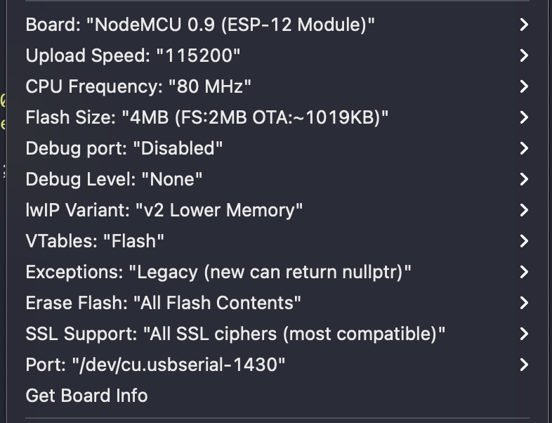

# Home Assistant Simple Motorised Roller Blind

This project was inspired by the excellent work of [nidayand](https://github.com/nidayand) and their [motor-on-roller-blind-ws](https://github.com/nidayand/motor-on-roller-blind-ws) project. Basically I stripped that project back to it's bare bones and implemented WiFi AP mode so MQTT configuration can be done without need for code changes.

The initial parts for the project were printed from [Motor on a roller blind](https://www.thingiverse.com/thing:2392856) by [ pgote](https://www.thingiverse.com/pgote/designs). I then created a "better" enclosure to house the components [here](https://www.thingiverse.com/thing:4788792).

Enjoying this? Help me out with a :beers: or :coffee:!

## Contents ##

* [Prerequisites](https://github.com/jampez77/motor_blind#prerequisites)
* [Setup](https://github.com/jampez77/motor_blind#setup)
* [Changelog](https://github.com/jampez77/motor_blind#changelog)

## Prerequisites ##

**Software**
* [Arduino IDE](https://www.arduino.cc/en/main/software) - I'm using v1.8.13
* Stepper_28BYJ_48 - v1.0.0
* ESP8266WiFi
* ESP8266WebServer
* WiFiManager - 2.0.3-alpha
* PubSubClient - v2.7.0
* ArduinoOTA

**Hardware**

* [ULN2003 Board Driver with Stepper Motor](https://www.amazon.co.uk/gp/product/B07RLLKFGK/ref=ppx_yo_dt_b_asin_title_o02_s00?ie=UTF8&psc=1)
* [Node MCU](https://www.amazon.co.uk/AZDelivery-NodeMcu-Amica-Development-including/dp/B06Y1LZLLY)
* [Motor on a roller blind 3D printed holder](https://www.thingiverse.com/thing:2392856)
* 9V - 12V DC power supply.

**Optional Extras**

If you want to end up with your device in a neat little enclosure like this then you'll need these few extras, access to a 3D printer and soldering iron.
* [ULN2003 Board Driver (smaller form factor)](https://www.amazon.co.uk/gp/product/B07MS1P2TX/ref=ppx_yo_dt_b_asin_title_o03_s00?ie=UTF8&psc=1)
* [2.1mm Barrel Jack Plug](https://www.amazon.co.uk/gp/product/B089DXQDS9/ref=ppx_yo_dt_b_asin_title_o02_s00?ie=UTF8&psc=1) - ATTENTION, this requirement might change slightly for you if you have a different power input. Check that first!
* [PCB Board female headers](https://www.amazon.co.uk/gp/product/B08D3DHKJL/ref=ppx_yo_dt_b_asin_title_o02_s00?ie=UTF8&psc=1)
* [Motor on a Roller Blind by pgote](https://www.thingiverse.com/thing:2392856)
* [Enclosure for project](https://www.thingiverse.com/thing:4441076)

## Setup ##

**Step 1 - Flashing project to the NodeMcu**

***The Quick Way***
Each release now includes a `.bin` file which can be pushed right onto your device.

You can get the latest `.bin` files from the [releases page](https://github.com/jampez77/motor_blind/releases).

Once you have it, you can flash the NodeMCU by using a program like [Tasmotizer](https://www.superhouse.tv/37-installing-tasmota-using-tasmotizer/). Once you have successfully written the binary to the device you can move onto the next step.

***The Long Way***
Once you have setup your software, you first need to download this project, by clicking `clone -> Download ZIP`.

Now open `motor_blind.ino`. Doing so should open it in the [Arduino IDE](https://www.arduino.cc/en/main/software).

ATTENTION!: You no longer need to make any changes to the code in order for this project to work.

Configuration is now done by connecting to the devices WiFi access point.

The next step, once you're happy with the details is to upload the project to the Wemos D1 Mini.

To do that you select `Tools` from the top menu within the IDE.

Then you need to set the upload parameters to the following;

The next step is to simply plug your device in the computer, Go to `Tools -> Port` and select it.

For me this usually says something `dev/usbserial...`

You will only need the device plugged in on your first upload, after that you should see your devices name and it's IP address in the port list.

Now you just click on the upload button in the top left corner of the IDE, it's the right-facing arrow.

After a bit of time compiling, the script should be uploaded to the device and begin scanning for the car.

You can see what the device is doing by going to `Tools -> Serial Monitor`

**Step 2 - Wiring**

Wiring is very similar to the original version described [here](https://www.thingiverse.com/thing:2392856) with one key difference. We connect `IN4` to `D5` as I `D4` on the NodeMCU is the builtin LED, that is used to show any connection problem.

Connect 9v directly to Vin on NodeMCU board (validate first that your version has a built in regulator for 9V) and to the ULN2003 board.

5V is simply not enough to be able to control the blinds, even with the higher gear ratio, so ULN2003 requires 9V.

Connect the board to the NodeMCU as follows:

`D1` = `IN1`, `D2` = `IN3`, `D3` = `IN2`, `D5` = `IN4`

If you've opted the PCB setup use this photo as your wiring diagram.

**Step 3 - Initial Configuration**

Once the project has successfully booted up for the first time it will go into WiFi pairing mode by creating a wireless access point. Using a WiFi enabled device you should now see at network with a name like `Blinds-1828394`.

Connect to that network with the password `nandpezblinds`.

Once connected navigate to `192.168.4.1` in a browser. You should be presented with the main screen:

Click `Configure WiFi` and fill in all the details shown below:

Click `Save` once you are happy with the details you have entered.

Providing everything went ok the Access Point will be deactivated and the device should be in the [MQTT integrations page](https://www.home-assistant.io/integrations/mqtt/).

**Step 4 - Setting up the blinds in Home Assistant**

***HA Pre-requisites***
[MQTT discovery](https://www.home-assistant.io/docs/mqtt/discovery/) needs to be activated.

One first connection you should see 5 entities `Set Open`, `Set Closed`, `Full Reset`, `WiFi AP` and the device name you entered e.g. `Study Blinds`.

You should manually set the blinds as open, to the level you are happy to regard as fully open. Once this is done you should `turn on` the `Set Open` switch. This will save the current position as the open value, then that entity will disappear front Home Assistant.

Next step is to close the blinds using the cover entity. Stop the blinds once they reach a position that you're happy to regard as closed. Now `turn on` the `Set Closed` switch to save the closed position.

The setup is complete once the `Set Closed` entity has disappeared If you ever need to change the open or close values you can simply `turn on` the `Reset Limits` switch. This will remove the saved limit values on the device and create the `Set Open` & `Set Closed` entities again.

Turn on `WiFi AP` button if you need to get the `WiFi` or `MQTT` details stored on the device.

## Changelog ##

### Version 2.1 - More config via HA ###

Created `Reset Limits` button that will remove stored values for `Open` and `Closed` limits so they can be changed. This button will only appear in HA once a limit has been set.

Created `WiFi AP` button that will reboot into a wireless access point so `WiFi` or `MQTT` details can be changed. Press `Save` in the `WiFi Config` page to reboot the device again and connect it back to HA.

Additionally:

I updated to [these motor drivers](https://www.amazon.co.uk/gp/product/B07MS1P2TX/ref=ppx_yo_dt_b_asin_title_o03_s00?ie=UTF8&psc=1) as the smaller form factor allows the whole device to fit on a proto board in a custom enclosure.

THIS IS ENTIRELY OPTIONAL AS THE WIRING IS EXACTLY THE SAME. If you're not bothered about fitting your device into a nice neat little box then you don't need to pay any attention to this.

### Version 2.0 - Created WiFi Access Point setup (Breaking Changes) ###

Moved MQTT topics so they're defined in `setup` using the `deviceId`.

Added `WiFiManager` so project can be setup without code changes.

Renamed setup switches in HA to more descriptive names.

***Breaking Changes***
MQTT topics are now auto generated which means that topics produced manually in previous version will not carry across when updating from version 1.x.

### Version 1.1 - Simplified process for having multiple project instances in HA ###

Created `deviceName` variable so only a single change is required to create a new device in HA.

Tweaked topics and devices names/IDs so each instance appears as separate device in HA.

Increase JSON memory allocation by 50 characters to allow for larger device names.

Updated variables for MQTT server to be more specific and allow port to be changed.

### Version 1.0 - Initial Release ###

#### LED status indicator ####
* Solid light = No WiFi connection
* Flashing Light = no MQTT connection
* No light = connection established

ArduinoOTA for wireless code updates.

Added MQTT config on boot to integrate seamlessly with Home Assistant.
